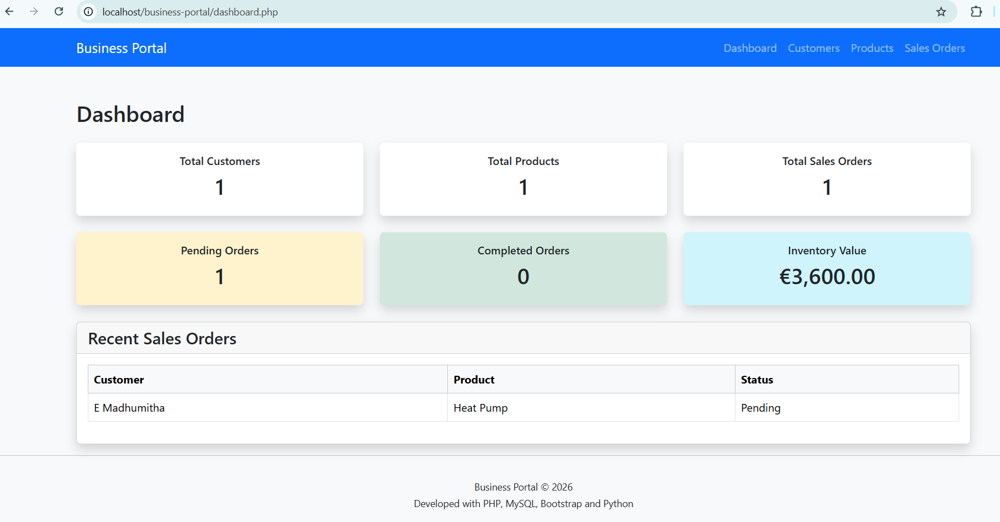
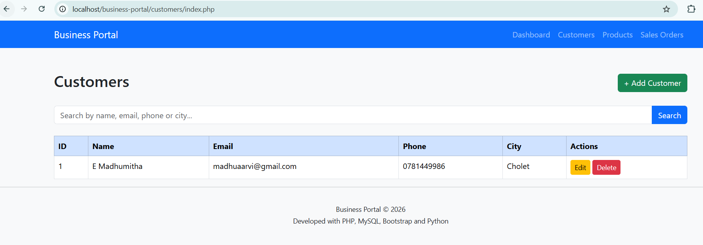
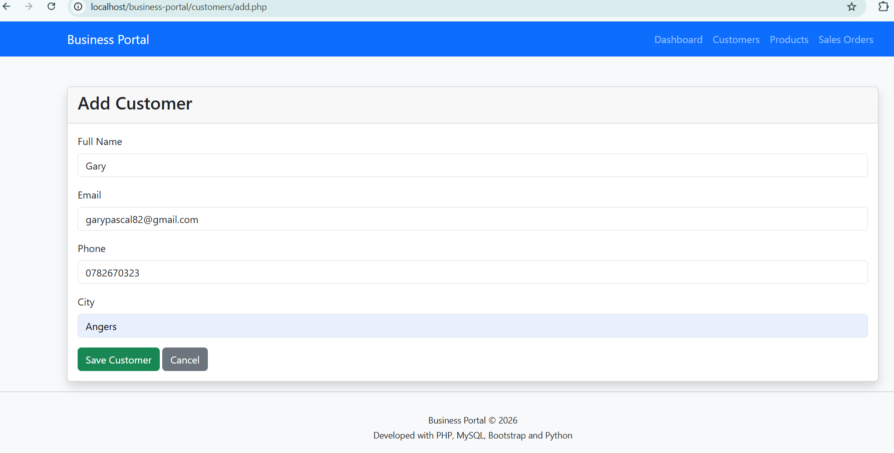
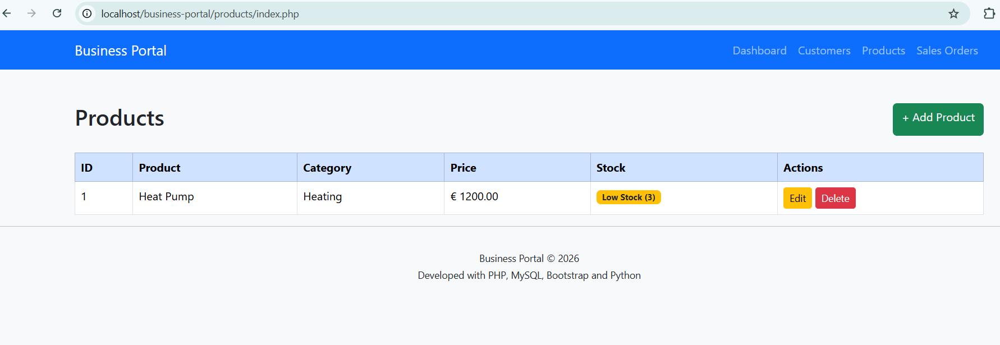
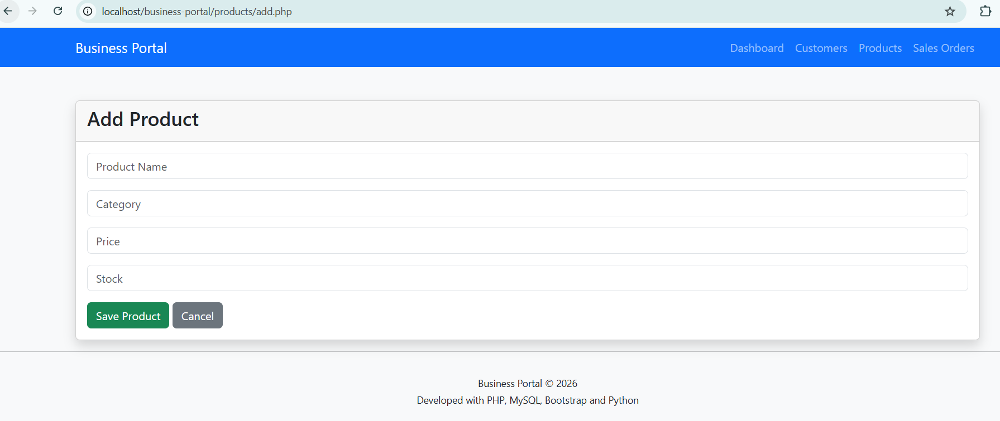
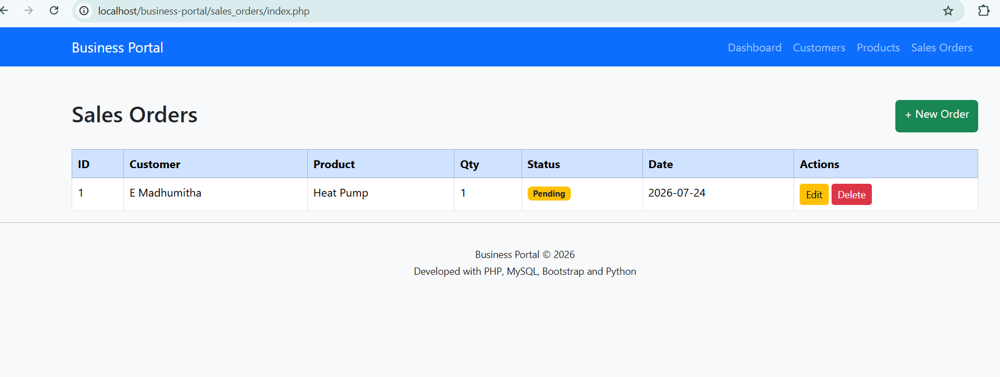
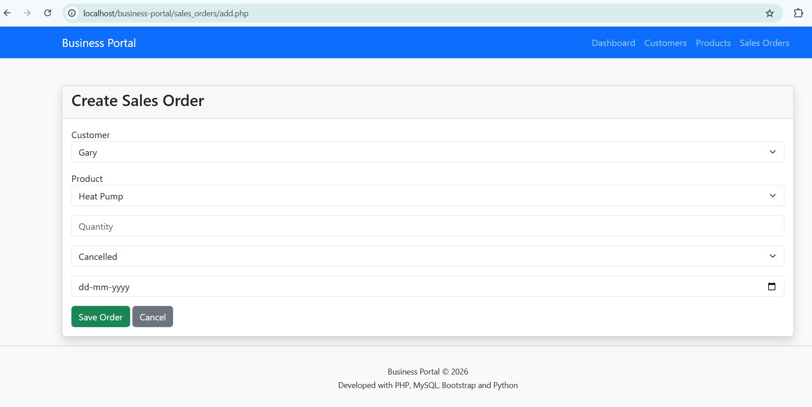
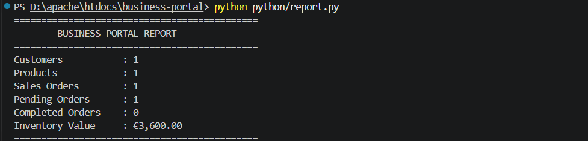

# Business Portal

A Business Management System developed using **PHP**, **MySQL**, **Bootstrap**, **Python**, and **Git**.

This project demonstrates customer management, product inventory management, sales order tracking, business dashboard reporting, and Python-based database reporting.

---

## Features

- Dashboard with Business KPIs
- Customer Management (CRUD)
- Customer Search
- Product Management (CRUD)
- Low Stock Indicator
- Sales Order Management
- Order Status Badges
- Recent Sales Orders Dashboard
- Python Business Report
- Responsive Bootstrap Interface

---

## Technologies

- PHP 8
- MySQL
- Bootstrap 5
- Python 3
- HTML5
- CSS3
- Git
- XAMPP
- VS Code

---

## Database

Tables used:

- customers
- products
- sales_orders

Relationships:

- One Customer → Many Sales Orders
- One Product → Many Sales Orders

---

## Project Structure

```text
business-portal/

├── config/
│   └── db.php
│
├── customers/
│   ├── index.php
│   ├── add.php
│   ├── edit.php
│   └── delete.php
│
├── products/
│   ├── index.php
│   ├── add.php
│   ├── edit.php
│   └── delete.php
│
├── sales_orders/
│   ├── index.php
│   ├── add.php
│   ├── edit.php
│   └── delete.php
│
├── python/
│   └── report.py
│
├── dashboard.php
├── index.php
└── README.md
```

---

## Screenshots

### Dashboard



### Customers





### Products





### Sales Orders





### Python Report



---

## Python Report

The Python module connects directly to MySQL and generates business statistics.

Example output:

```text
======================================
BUSINESS PORTAL REPORT
======================================

Customers           : 10
Products            : 8
Sales Orders        : 22
Pending Orders      : 4
Completed Orders    : 17
Inventory Value     : €18500.00
```

---

## Skills Demonstrated

- PHP Development
- CRUD Operations
- SQL JOIN
- Relational Database Design
- Bootstrap UI
- Business Dashboard Development
- Python Database Integration
- Git Version Control

---

## Future Improvements

- User Authentication
- Prepared Statements
- Pagination
- Export Reports to PDF
- Charts and Analytics
- Email Notifications

---

## Author

**Madhumitha Ezhumalai**

GitHub:
https://github.com/Madhuhamsaa